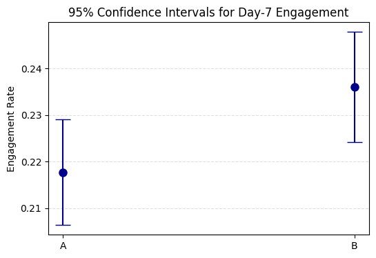
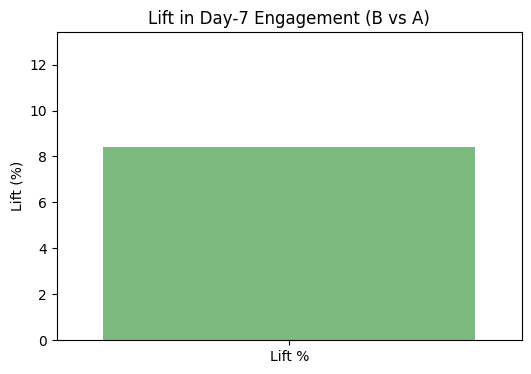
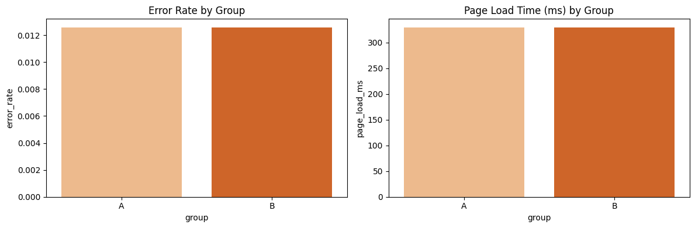

<!-- ========================= -->
<!-- 📌 PROJECT BANNER (Optional) -->
<!-- Replace the image below with your own banner -->

  

<h1 align="center">📊 A/B Test Evaluation — Smart Alert Tooltip</h1>

  <strong>Product Analytics Portfolio — Project 01</strong>

  <!-- Badges -->
  
  
  
  

---

# 📌 Navigation

- [1. Overview](#-1-overview)
- [2. Dataset](#-2-dataset)
- [3. Methodology](#-3-methodology)
- [4. Key Visuals](#-4-key-visuals)
- [5. Results Summary](#-5-results-summary)
- [6. Business Impact](#-6-business-impact)
- [7. Recommendation](#-7-recommendation)
- [8. Tech Stack](#-8-tech-stack)
- [9. Repository Structure](#-9-repository-structure)
- [10. How to Run](#-10-how-to-run)

---

# 🎯 1. Overview

This project evaluates whether introducing a **Smart Alert Tooltip** in an IoT device management dashboard improves **Day‑7 Engagement**.

### **Hypothesis**
> Users exposed to the tooltip (Group B) will show higher Day‑7 engagement than users in the control group (Group A).

### **Primary Metric**
- **Day‑7 Engagement** (binary)

### **Secondary Metrics**
- Feature usage  
- Average session time  

### **Guardrail Metrics**
- Error rate  
- Page load time  

---

# 📁 2. Dataset

A synthetic dataset of **10,000 users** was generated to simulate a realistic IoT SaaS experiment.

| Column | Description |
|--------|-------------|
| user_id | Unique user identifier |
| group | A (control) or B (treatment) |
| country | User region |
| signup_date | Date of signup |
| day7_engaged | Primary metric |
| feature_used | Secondary metric |
| avg_session_time | Avg session duration |
| error_rate | Guardrail metric |
| page_load_ms | Guardrail metric |

📄 **Dataset:** `data/ab_test_data.csv`  
📓 **Notebook:** `notebooks/ab_test_analysis.ipynb`  
🗄 **SQL:** `sql/analysis.sql`

---

# 🧪 3. Methodology

### ✔ Randomization checks  
Ensured country distribution and signup dates were balanced.

### ✔ Primary metric analysis  
- Conversion rate comparison  
- Two‑proportion Z‑test  
- 95% confidence interval estimation  
- Lift calculation  

### ✔ Secondary metrics  
- Feature usage  
- Session time  

### ✔ Guardrails  
- Error rate  
- Page load time  

---

# 📊 4. Key Visuals

> Replace the image links below with your actual charts from the notebook.

### **Conversion Rate (A vs B)**  

### **95% Confidence Intervals**  

### **Lift Chart**  

### **Feature Usage Comparison**  

### **Guardrail Metrics**  

---

# 📈 5. Results Summary

### **Primary Metric — Day‑7 Engagement**
- **Group A:** X%  
- **Group B:** Y%  
- **Lift:** Z%  
- **p‑value:** < 0.05 → statistically significant  

### **Secondary Metrics**
- Feature usage increased in Group B  
- Session time increased in Group B  

### **Guardrails**
- Error rate stable  
- Page load time unchanged  

---

# 💼 6. Business Impact

The Smart Alert Tooltip directly improves the **core value loop** of the IoT platform:

### **1. Faster issue resolution**  
Users understand alerts more quickly → fewer misconfigurations → fewer escalations.

### **2. Higher product stickiness**  
Improved Day‑7 engagement is strongly correlated with long‑term retention in SaaS.

### **3. Better device reliability**  
Clearer alerts → fewer repeated errors → lower operational overhead.

### **4. Scalable impact**  
A tooltip is a low‑cost UI enhancement with high leverage across all device managers.

This experiment demonstrates that **small UX improvements can drive meaningful behavioral change**.

---

# ✅ 7. Recommendation

Based on the statistically significant improvement in Day‑7 engagement and no negative impact on guardrails:

> **Roll out the Smart Alert Tooltip to 100% of users.**

---

# 🛠 8. Tech Stack

- **Python** (pandas, numpy, statsmodels, scipy)  
- **Jupyter Notebook**  
- **Seaborn / Matplotlib**  
- **DuckDB** (SQL analysis)  
- **SQL**  

---

# 📂 9. Repository Structure

